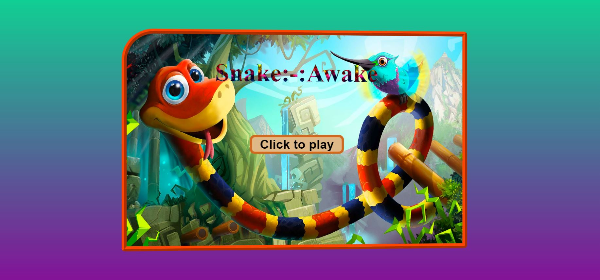
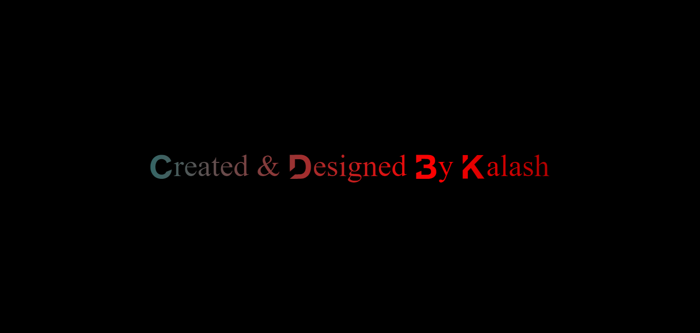
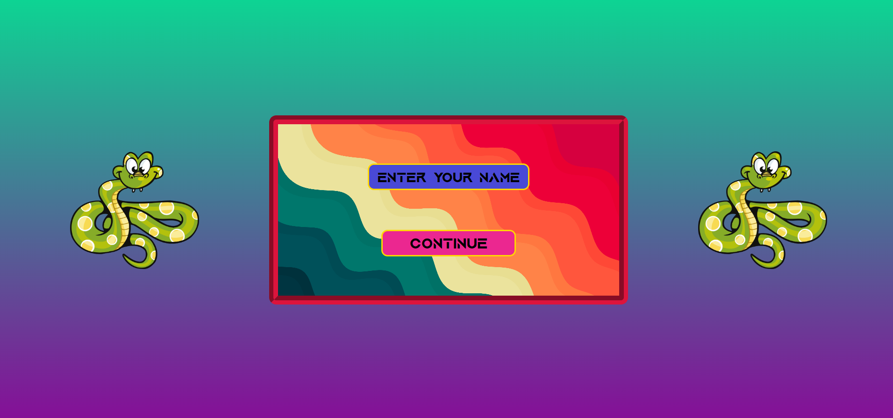
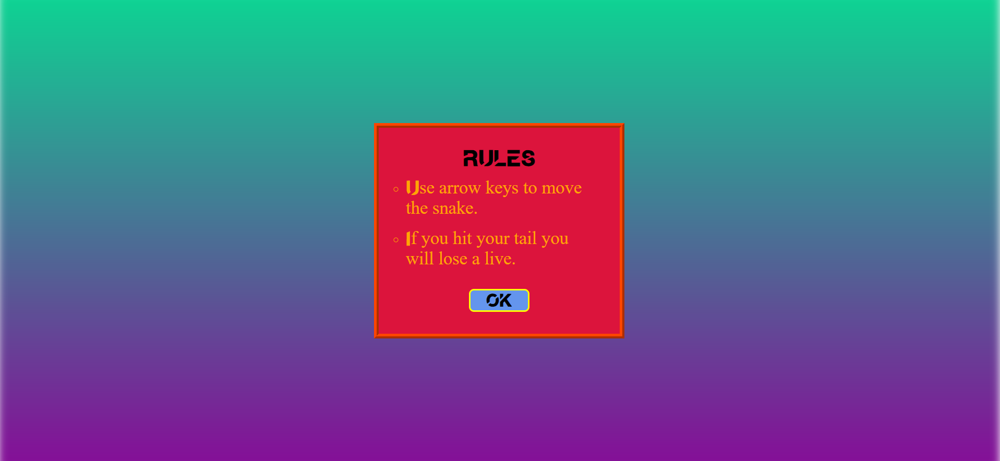
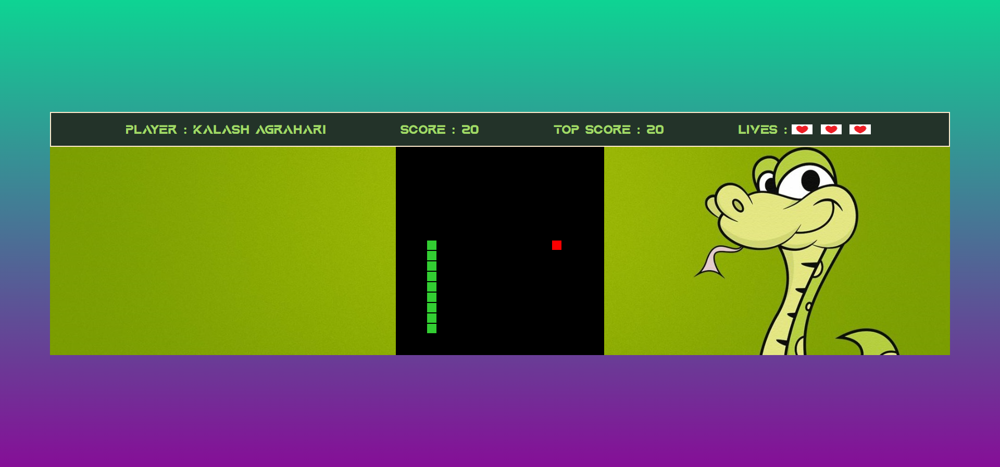

# Snake Awake

Snake Awake is a modern take on the classic snake game, developed using HTML, CSS, and JavaScript. Enjoy a sleek and engaging user interface along with responsive controls and sound effects that make the game more immersive.

## Features

- **Classic Gameplay**: Navigate the snake to collect food and grow longer, but be careful not to run into the walls or yourself.
- **Responsive Controls**: Use all four arrow keys to move the snake in four directions (up, down, left, right).
- **Lives System**: The player has 3 lives, providing multiple chances to achieve a high score.
- **Single Player Mode**: Compete against yourself and try to beat your own high score.
- **Sound Effects**: Enjoy sound effects that enhance the gameplay experience.
- **Good UI/UX**: The game features an intuitive and visually appealing interface.

## Snapshots

*Initialization*

*Creator*

*Player Name*

*Rules and controls*

*Gameplay*

## To play

Vist the [live](https://code2forever.github.io/snakeawake/) link.

## How to Play

- **Controls**: Use the arrow keys to move the snake in four directions.
- Game will stop once you lose all your lives.

## Contributing

Contributions are welcome! If you'd like to improve the game, please fork the repository and create a pull request.
